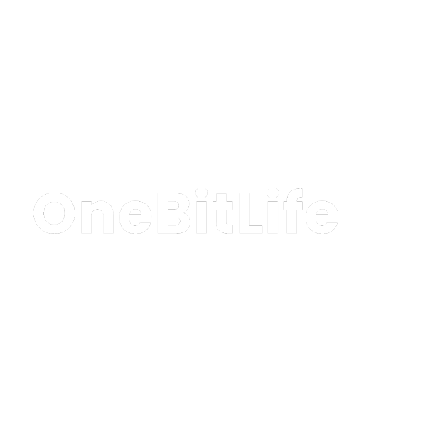

<div align="center">

  

  ### 🎮 Transforme sua vida em um jogo, buscando sempre o seu melhor nível.

  [](https://reactnative.dev/)
  [](https://expo.dev/)
  [](https://nodejs.org/)
  [](https://github.com/Intern-Yago/OneBitLife/releases)
  [](LICENSE)

  <br />

  [🌐 Ver Página Web (Landing Page)](./index.html) • [📱 Baixar APK (Releases)](https://github.com/Intern-Yago/OneBitLife/releases) • [📖 Documentação](#-sumário)

</div>

---

## 📋 Sumário

- [Sobre o Projeto](#-sobre-o-projeto)
- [Funcionalidades Principais](#-funcionalidades-principais)
- [Os 4 Pilares da Vida](#-os-4-pilares-da-vida)
- [Tecnologias Utilizadas](#-tecnologias-utilizadas)
- [Arquitetura de Pastas](#-arquitetura-de-pastas)
- [Como Executar o Projeto](#-como-executar-o-projeto)
- [Pipeline de CI/CD & Automação de Release](#-pipeline-de-cicd--automação-de-release)
- [Licença](#-licença)

---

## 🧠 Sobre o Projeto

O **OneBitLife** é um aplicativo mobile desenvolvido com React Native e Expo que aplica os princípios de **gamificação na construção de hábitos**. 

Assim como em um jogo RPG, o usuário possui um mascote virtual cujos níveis de energia, humor e saúde variam de acordo com o cumprimento das suas tarefas diárias. Caso o usuário negligencie seus hábitos e suas barras de vida cheguem a zero, o jogo entra em **Game Over**, incentivando a disciplina diária e a consistência pessoal de forma leve e divertida.

---

## ⚡ Funcionalidades Principais

- 🎯 **Gestão de Hábitos Personalizados**: Criação, edição e exclusão de hábitos em 4 categorias vitais.
- 🔁 **Frequências Customizadas**: Definição de hábitos Diários, Semanais ou Mensais.
- 📊 **Barras de Status Dinâmicas**: Acompanhamento visual da saúde de cada pilar da vida.
- 🤖 **Mascote Reativo (LifeStatus)**: Animações em tempo real via Lottie que reagem ao desempenho do usuário.
- 💀 **Mecânica de Game Over**: Sistema de risco onde zerar uma barra resulta no reinício da jornada.
- 🔥 **Contador de Checks & Sequência (Streak)**: Rastreamento de dias consecutivos vivo e total de checks concluídos.
- 💾 **Persistência Offline (SQLite)**: Banco de dados relacional local embarcado no dispositivo.
- 🔔 **Notificações Locais**: Lembretes para não esquecer de realizar os checks do dia.

---

## 🎨 Os 4 Pilares da Vida

O aplicativo divide os hábitos em quatro pilares fundamentais, cada um representado por uma identidade visual distinta:

| Pilar | Cor | Descrição |
| :--- | :---: | :--- |
| 🧠 **Mente** | `#90B7F3` | Leitura, estudos, meditação e foco mental. |
| 💰 **Financeiro** | `#85BB65` | Controle de gastos, investimentos e reserva financeira. |
| 💪 **Corpo** | `#FF0044` | Exercícios físicos, hidratação e alimentação saudável. |
| 🥳 **Humor** | `#FE7F23` | Lazer, momentos em família e saúde emocional. |

---

## 🛠 Tecnologias Utilizadas

### Core & UI
- **React Native** (v0.70.8) - Framework multiplataforma.
- **Expo SDK** (v47) - Ecossistema de desenvolvimento mobile.
- **React Navigation** (v6) - Navegação entre telas (Native Stack).
- **React Native Paper** - Componentes de interface.
- **Lottie React Native** - Animações vetoriais interativas.

### Banco de Dados & Serviços
- **Expo SQLite** - Armazenamento de dados local e offline-first.
- **Expo Notifications** - Agendamento de notificações push locais.
- **Expo File System & Asset** - Gestão de recursos locais.

### Automação & CI/CD
- **GitHub Actions** - Workflows de integração e entrega contínua.
- **Expo EAS Build** - Geração automatizada de APKs Android na nuvem.
- **Node.js (v20)** - Runtime do ambiente de automação.

---

## 📁 Arquitetura de Pastas

```text
OneBitLife/
├── .github/
│   ├── scripts/
│   │   └── bump-version.js       # Script de versionamento semântico e Changelog
│   └── workflows/
│       └── release.yml           # Workflow do GitHub Actions para Build e Release
├── src/
│   ├── assets/                   # Ícones, imagens e animações Lottie do robô
│   ├── components/               # Componentes reutilizáveis de UI
│   │   ├── Common/               # Botões, Mascote LifeStatus, etc.
│   │   ├── Explanation/          # Cards explicativos
│   │   └── Home/                 # Barras de progresso e edição de hábitos
│   ├── Database/                 # Inicialização e SQL do Expo SQLite
│   ├── pages/                    # Telas da aplicação (Start, Explanation, Home, HabitPage)
│   ├── routes/                   # Configuração das rotas de navegação
│   └── services/                 # Serviços de negócio (Habits, Checks, Navigation)
├── app.json                      # Configurações do Expo (Versão, versionCode, etc.)
├── eas.json                      # Perfil de compilação EAS (androidApk)
├── CHANGELOG.md                  # Histórico de alterações do projeto
├── index.html                    # Página de apresentação / Landing Page Web
└── package.json                  # Dependências e scripts do projeto
```

---

## 🚀 Como Executar o Projeto

### Pré-requisitos
- **Node.js** (versão 20.x recomendada)
- **Expo CLI** (`npm install -g expo-cli`)
- Aplicativo **Expo Go** (disponível no Google Play / App Store) ou Emulador Android/iOS.

### Passo a Passo

1. **Clonar o repositório:**
   ```bash
   git clone https://github.com/Intern-Yago/OneBitLife.git
   cd OneBitLife
   ```

2. **Instalar as dependências:**
   ```bash
   npm install
   ```

3. **Iniciar o servidor de desenvolvimento:**
   ```bash
   npm start
   ```

4. **Executar no dispositivo ou emulador:**
   - Abra o **Expo Go** no celular e escaneie o QR Code exibido no terminal.
   - Ou pressione `a` no terminal para abrir no emulador Android.

---

## ⚙️ Pipeline de CI/CD & Automação de Release

O repositório possui uma esteira automatizada configurada via **GitHub Actions** (`.github/workflows/release.yml`).

### Como disparar uma nova Release:

1. Acesse a aba **Actions** no repositório do GitHub.
2. Selecione o workflow **Release & Build Expo APK**.
3. Clique em **Run workflow** e escolha o tipo de incremento:
   - `patch` (ex: 1.0.0 -> 1.0.1)
   - `minor` (ex: 1.0.0 -> 1.1.0)
   - `major` (ex: 1.0.0 -> 2.0.0)

### O que o Workflow realiza automaticamente:
1. 🔢 Atualiza a versão no `package.json` e `app.json` (incrementando o `versionCode` do Android).
2. 📝 Coleta o histórico dos commits e atualiza o `CHANGELOG.md`.
3. 🏷️ Cria o commit de release, gera a Tag Git e faz o push para o repositório.
4. 🩺 Executa a verificação do `npx expo-doctor`.
5. ☁️ Realiza a compilação do APK via **Expo EAS Cloud**.
6. 📦 Baixa o `.apk` gerado e cria automaticamente a **Release no GitHub** com o APK anexado nos assets.

---

## 📄 Licença

Este projeto está sob a licença **MIT**. Veja o arquivo [LICENSE](LICENSE) para mais detalhes.

---

<div align="center">
  Desenvolvido com ❤️ por <a href="https://github.com/Intern-Yago">Intern-Yago</a>
</div>
